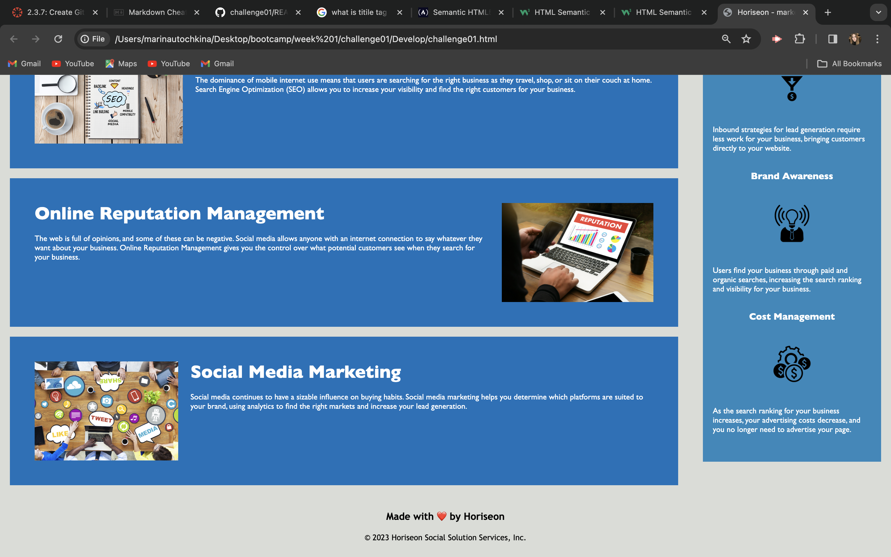

# Week 1 Challange
This repository contains refactor code from Week 1 Challenge of the University of Miami coding bootcamp.

## USER STORY
 AS A marketing agency 
 I WANT a codebase that follows accessibility standards 
 SO THAT our own site is optimized for search engines

## ACCEPTANCE CRITERIA 
GIVEN a webpage meets accessibility standards

1. WHEN I view the source code THEN I find semantic HTML elements
2. WHEN I view the structure of the HTML elements THEN I find that the elements follow a logical structure independent of styling and positioning
3. WHEN I view the image elements THEN I find accessible alt attributes
4. WHEN I view the heading attributes THEN they fall in sequential order
5. WHEN I view the title element THEN I find a concise, descriptive title

## Starter code 

    <!DOCTYPE html>
    <html lang="en-us">

    <head>
        <meta charset="UTF-8" />
        <link rel="stylesheet" href="./assets/css/style.css">
        <title>website</title>
    </head>

    <body>
    

        <h1>Horiseon</h1>
        

            <ul>
                <li>
                    <a href="#search-engine-optimization">Search Engine Optimization</a>
                </li>
                <li>
                    <a href="#online-reputation-management">Online Reputation Management</a>
                </li>
                <li>
                    <a href="#social-media-marketing">Social Media Marketing</a>
                </li>
            </ul>
        

    

    

    

        

            
            <h2>Search Engine Optimization</h2>
            

                The dominance of mobile internet use means that users are searching for the right business as they travel, shop, or sit on their couch at home. Search Engine Optimization (SEO) allows you to increase your visibility and find the right customers for your business.
            

        

        

            
            <h2>Online Reputation Management</h2>
            

                The web is full of opinions, and some of these can be negative. Social media allows anyone with an internet connection to say whatever they want about your business. Online Reputation Management gives you the control over what potential customers see when they search for your business.
            

        

        

            
            <h2>Social Media Marketing</h2>
            

                Social media continues to have a sizable influence on buying habits. Social media marketing helps you determine which platforms are suited to your brand, using analytics to find the right markets and increase your lead generation.
            

        

    

    

        

            <h3>Lead Generation</h3>
            
            

                Inbound strategies for lead generation require less work for your business, bringing customers directly to your website.
            

        

        

            <h3>Brand Awareness</h3>
            
            

                Users find your business through paid and organic searches, increasing the search ranking and visibility for your business.
            

        

        

            <h3>Cost Management</h3>
            
            

                As the search ranking for your business increases, your advertising costs decrease, and you no longer need to advertise your page.
            

        

    

    

        <h2>Made with ❤️️ by Horiseon</h2>
        

            &copy; 2024 Horiseon Social Solution Services, Inc.
        

    

</body>

    </html>

## **Changes made to the code**

In order to satisfy the *ACCEPTANCE CRITERIA*, the following steps were performed:

1. Looked through the starter html code and found that the code is missing some semantic elements.
2. Added semantic elements `header`, `nav`, `main` and `footer`.
3. To the structure of the html document simpler and more logical, deleted unnesseccary classes and edited css file to avoid repeatition of the code.
4. Added alt attributes to all the `img` tags and title attributes to all the link, to make the web application more accessible. 
5. Changed the page `title` to "Horiseon marketing agency" so that ir could appear more often in search engine results. 

## Refactor code 

    <!DOCTYPE html>
    <html lang="en-us">

    <head>
    <meta charset="UTF-8" />
    <link rel="stylesheet" href="./assets/css/challenge01style.css">
    <title>Horiseon - marketing agency</title>
        </head>

    <body>
    <header>
        <h1>Horiseon</h1>
        <nav>
            <ul>
                <li>
                    <a href="#search-engine-optimization" title="link to the search engine optimization">Search Engine Optimization</a>
                </li>
                <li>
                    <a href="#online-reputation-management" title="link to the online reputation management">Online Reputation Management</a>
                </li>
                <li>
                    <a href="#social-media-marketing" title="link to the social media marketing">Social Media Marketing</a>
                </li>
            </ul>
        </nav>
    </header>
    <main>
        

        

            

                
                <h2>Search Engine Optimization</h2>
                

                    The dominance of mobile internet use means that users are searching for the right business as they travel, shop, or sit on their couch at home. Search Engine Optimization (SEO) allows you to increase your visibility and find the right customers for your business.
                

            

            

                
                <h2>Online Reputation Management</h2>
                

                    The web is full of opinions, and some of these can be negative. Social media allows anyone with an internet connection to say whatever they want about your business. Online Reputation Management gives you the control over what potential customers see when they search for your business.
                

            

            

                
                <h2>Social Media Marketing</h2>
                

                    Social media continues to have a sizable influence on buying habits. Social media marketing helps you determine which platforms are suited to your brand, using analytics to find the right markets and increase your lead generation.
                

            

        

        

            

                <h3>Lead Generation</h3>
                
                

                    Inbound strategies for lead generation require less work for your business, bringing customers directly to your website.
                

            

            

                <h3>Brand Awareness</h3>
                
                

                    Users find your business through paid and organic searches, increasing the search ranking and visibility for your business.
                

            

            

                <h3>Cost Management</h3>
                </img>
                

                    As the search ranking for your business increases, your advertising costs decrease, and you no longer need to advertise your page.
                

            

        

    </main>
    <footer>
        <h2>Made with ❤️️ by Horiseon</h2>
        

            &copy; 2023 Horiseon Social Solution Services, Inc.
        

    </footer>
    </body>

    </html>

## Web page in browser

